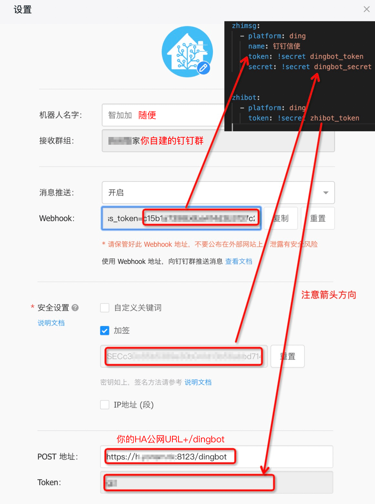
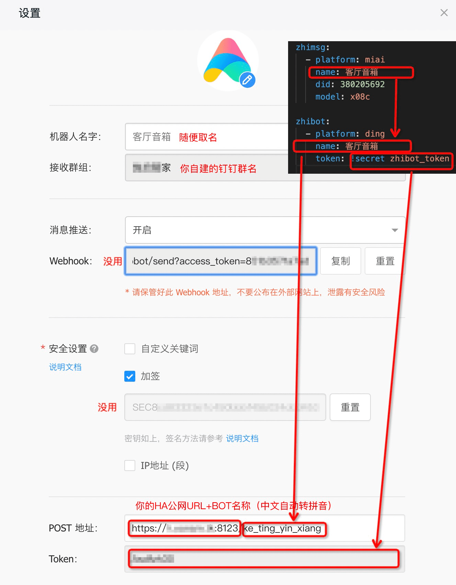

# ZhiBot

Uniform Bot Platform for HomeAssistant

通用交互式机器人平台，目前支持天猫精灵、小爱同学、钉钉群机器人。

**安装**：把 `zhibot` 放入 `custom_components`；也支持在 [HACS](https://hacs.xyz/) 中添加自定义库的方式安装。

_提示：如果只用了单个平台，可以把未使用的平台文件删除，如只用了天猫精灵，可以删除掉 `dingbot.py` 和 `miaibot.py`。_

**配置**：参见下文。也可以参考 [我的 Home Assistant 配置](https://github.com/Yonsm/.homeassistant) 中 [configuration.yaml](https://github.com/Yonsm/.homeassistant/blob/main/configuration.yaml)

## 一、天猫精灵机器人 [geniebot](https://github.com/Yonsm/ZhiBot/blob/main/custom_components/zhibot/geniebot.py)

一次性接入 Home Assistant 的大部分设备到天猫精灵，通过天猫精灵语音控制开关设备、查询传感器。无需第三方服务器，直接使用 Home Assistant 作为服务器和 OAuth，链路高效。

### 1. Home Assistant 配置

```yaml
zhibot:
    - platform: genie
```

无需配置 `token`，会修正 HA 的 OAuth 认证方式延长认证有效期（借鉴来的套路，参见 [oauthbot](https://github.com/Yonsm/ZhiBot/blob/main/custom_components/zhibot/__init__.py)，我也没搞明白）。建议配置 `token`，这样不用重写 HA 的 OAuth 认证有效期，此时下文中的 `网关 URL` 将变成 `https://xxx.xxx.xxx:8123//geniebot?token=******`。

### 2. 天猫精灵开放平台设置

#### 1). 登录 [天猫精灵开放平台](https://www.aligenie.com)，进入 `设备开发与接入` → `生活物联网平台` → `云云接入` → [技能开发](https://iot.aligenie.com/skill/home) → `添加新技能`。

#### 2). 服务设置如下：

-   网关 URL：`https://xxx.xxx.xxx:8123//geniebot`
-   Client ID：`https://open.bot.tmall.com`
-   Client Secret：`NA`
-   Authorization URL：`https://xxx.xxx.xxx:8123/auth/authorize`
-   Access Token URL：`https://xxx.xxx.xxx:8123/auth/token`

#### 3). `内容设置` → `技能发布` → `发布前验证` → `授权调试` → `账户配置`→ 输入 HA 账户密码 → 可看到你的设备列表。

_天猫精灵开放平台已升级为 2.0，这里有 [旧版本配置图示](https://github.com/Yonsm/ZhiBot/blob/main/HASS-GENIE.png?raw=true) 但已不相同，仅供参考。_

### 3. 使用方式

直接通过天猫精灵语音控制 HA 设备，如“天猫精灵，打开客厅灯”，也可以查询传感器，如“天猫精灵，阳台传感器 PM2.5”。

### 4. 更多定制

天猫精灵查询 HA 时，重要的三个参数需符合规范，否则天猫精灵理解不了：

-   `zone`：区域命名，如客厅、餐厅等，须符合 [placelist](https://open.bot.tmall.com/oauth/api/placelist) 规范。
-   `deviceName`：设备名称，须符合 [aliaslist](https://open.bot.tmall.com/oauth/api/aliaslist) 规范。
-   `deviceType`：设备类型，须符合 [支持的品类](http://doc-bot.tmall.com/docs/doc.htm?treeId=393&articleId=108271&docType=1) 规范。

`geniebot.py` 会尝试从 HA 配置信息中，根据规则尝试自动转换成天猫精灵匹配的名称和类型。但有些可能匹配不成功，此时可以在 [customize.yaml](https://github.com/Yonsm/.homeassistant/blob/main/customize.yaml) 中，定制天猫精灵能识别的区域、名称和类型，如：

```yaml
genie_zone: 客厅
genie_deviceName: 吸顶灯
genie_deviceType: outlet
```

其中 `genie_zone` 可以配置给单个设备，也可以配置高分组（将应用到分组下的所有设备）。

_**建议**：把设备分组，分组名从符合 `placelist` 规范；设备名符合 `aliaslist` 规范。这样全部会自动搞定，基本不用手动配置。_

## 二、小爱同学机器人 [miaibot](https://github.com/Yonsm/ZhiBot/blob/main/custom_components/zhibot/miaibot.py)

类似天猫精灵，但小爱同学的智能设备使用控制方式需要唤醒词语，实际体验远远没有天猫精灵好。_且需进入测试模式，有效时间短，要频繁重新进入测试模式，不建议使用。_

## 三、钉钉群机器人 [dingbot](https://github.com/Yonsm/ZhiBot/blob/main/custom_components/zhibot/dingbot.py) 之 `Home Assistant` ⇋ `钉钉群机器人` 双向互动

**钉钉群设置**：在钉钉群里添加自定义机器人，**勾选“是否开启 Outgoing 机制”**。据称此功能在内测，部分用户可能没有没有此选项，佛系或自行解决。

### 1. Home Assistant 配置

```yaml
zhimsg:
    - platform: ding
      name: 钉钉信使
      token: !secret dingbot_token
      secret: !secret dingbot_secret

zhibot:
    - platform: ding
      token: !secret zhibot_token
```

_**依赖**：需依赖 [ZhiMsg](https://github.com/Yonsm/ZhiMsg)，请一并安装好。_
_**注意**：`zhibot` 的 `- platform: ding` 没有配置 `name `。_

### 2. 钉钉群机器人设置



### 3. 使用方式

Home Assistant 可以给钉钉群机器人发送消息。也可以在钉钉群里面 @机器人 控制 Home Assistant，输入 `?` 查询使用样例，如下：

```
打开/关闭（设备或群组名）；查询（设备或群组名，可省略“查询”）；触发（自动化，可省略“触发”）
```

## 四、钉钉群机器人 [dingbot](https://github.com/Yonsm/ZhiBot/blob/main/custom_components/zhibot/dingbot.py) 之 `钉钉群机器人` → `Home Assistant` → `小爱音箱` 单向控制

**钉钉群设置**：在钉钉群里添加自定义机器人，**勾选“是否开启 Outgoing 机制”**。据称此功能在内测，部分用户可能没有没有此选项，佛系或自行解决。

### 1. Home Assistant 配置

```yaml
zhimi:
    username: !secret zhimi_username
    password: !secret zhimi_password

zhimsg:
    - platform: miai
      name: 客厅音箱
      did: 380205692
      model: x08c
    - platform: miai
      name: 过道音箱
      did: 89463074
      model: lx01

zhibot:
    - platform: ding
      name: 客厅音箱
      token: !secret zhibot_token
    - platform: ding
      name: 过道音箱
      token: !secret zhibot_token
```

_**依赖**：需依赖 [ZhiMi](https://github.com/Yonsm/ZhiMi) 和 [ZhiMsg](https://github.com/Yonsm/ZhiMsg)，请一并安装好。_
_**注意**：必须配置 `name`，并和 `ZhiMsg` 的小爱音箱同名。_

### 2. 钉钉群机器人设置



### 3. 使用方式

在钉钉群里面 @小爱音箱 来播报或执行文本。输入 `?` 查询使用样例，如下：

```
您好，我是小爱同学
查询天气
执行关灯
静默关灯
音量40
音量70%大声说您好
```

还可以 `??` 查询更多 MIoT 命令，如下：

```
Get Props: ?<siid[-piid]>[,...]
           ?1,1-2,1-3,1-4,2-1,2-2,3
Set Props: ?<siid[-piid]=[#]value>[,...]
           ?2=#60,2-2=#false,3=test
Do Action: ?<siid[-piid]> <arg1> [...]
           ?5 Hello
           ?5-4 Hello #1

Call MIoT: ?<cmd=prop/get|/prop/set|action> <params>
           ?action {"did":"380205692","siid":5,"aiid":1,"in":["Hello"]}

Call MiIO: ?/<uri> <data>
           ?/home/device_list {"getVirtualModel":false,"getHuamiDevices":1}

Devs List: ?list [name=full|name_keyword] [getVirtualModel=false|true] [getHuamiDevices=0|1]
           ?list Light true 0

MiIO Spec: ?spec [model_keyword|type_urn]
           ?spec
           ?spec speaker
           ?spec xiaomi.wifispeaker.lx04
           ?spec urn:miot-spec-v2:device:speaker:0000A015:xiaomi-lx04:1
```

## 五、参考

-   [ZhiMsg](https://github.com/Yonsm/ZhiMsg)
-   [Yonsm.NET](https://yonsm.github.io)
-   [Hassbian geniebot](https://bbs.hassbian.com/thread-2700-1-1.html)
-   [Hassbian miaibot](https://bbs.hassbian.com/thread-4680-1-1.html)
-   [Hassbian dingbot](https://bbs.hassbian.com/thread-12348-1-1.html)
-   [Hassbian ding2msgbot](https://bbs.hassbian.com/thread-12349-1-1.html)
-   [Yonsm's .homeassistant](https://github.com/Yonsm/.homeassistant)
